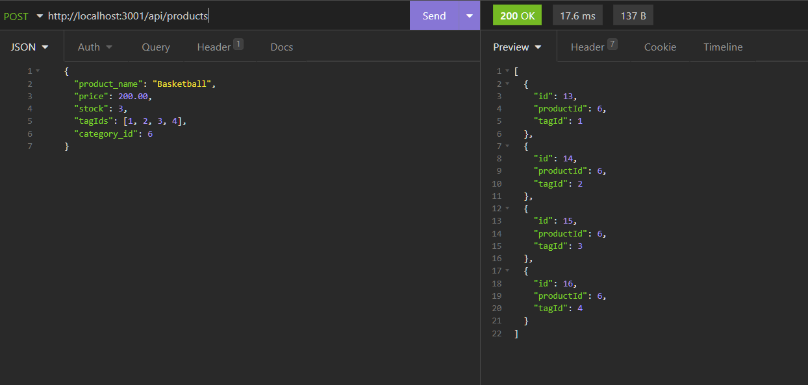

  # E-Commerce Back-End

  

  ## Table of Contents
  * [Description](#description)
  * [Installation](#installation)
  * [Usage](#usage)
  * [Questions](#questions)

  ## Description

  This back-end system allows the user to manage database items based on their Categories, Products, and associated Tags.

  You can see a video of the program in action [HERE!](https://watch.screencastify.com/v/DqsFPqpZcSsQWZu8hWri)

  

  ## Installation

  Follow the below steps to install the program:

  After cloning the repository, enter the following command in your terminal to install the necessary npm packages.

    npm i

  After installing the npm packages, use your terminal to log into mysql and enter the following command to initialize the database.
    
    SOURCE [schema file path goes here]

  Once the schema has been initialized, return to your regular terminal and enter this command.
    
    npm run seed

  ## Usage

  After installation, enter the following command into your terminal to start the back-end server.

    npm start

  Once the server is up and running, you can use an API platform (such as Postman or Insomnia) to navigate the data and run GET, POST, PUT, and DELETE queries.

  

  ## Questions

  For more information, feel free to contact me:

  GitHub: [github.com/stevengoldbergm](https://github.com/stevengoldbergm)
  